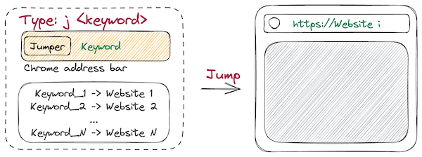
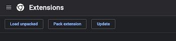
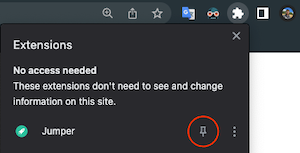
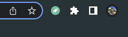
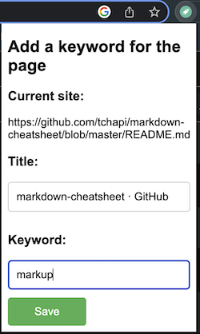
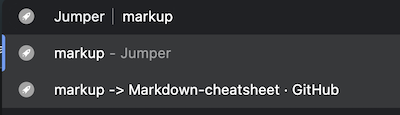
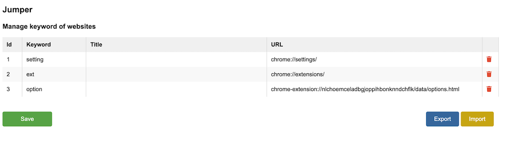

## Spotlight search and jump to any website with a short memorable keyword

>>  _No more wasting time typing in long URLs or sifting through bookmark folders_

### Main functions

* __Add a short memorable keyword to a website of your choice__       
* __Spotlight search by a keyword and jump to the website instantly__
* __Fully manage keywords you had created__

### Manual installation (Skip if installed from Chrome Store)
1. Clone this [repository](https://github.com/bruce-share/jumper/) onto your device or download [zip file](https://github.com/bruce-share/jumper/archive/refs/heads/main.zip).
2. Navigate to __`chrome://extensions/`__.
3. Turn on Developer mode option on the top right corner of the page to see the following buttons.
> 
4. Click __`Load unpacked`__ button and navigate to the root folder of this repository or the unzipped folder.
5. Select this folder, and the extension should load into your list of browser extensions.

### How to add a keyword for a website
#### Step 1: Pin the JumpX extension for quickly access
- Click the Extension button in the left corner of Chrome -> Click the Pin button next to the JumpX icon

> 

- The JumpX extension is pinned in the bar

> 

#### Step 2: Add a site to JumpX with a keyword
- Open a site -> Click the JumpX icon -> Type a memorable keyword for the site -> Click Save (or Enter)

> 

#### Step 3: Spotlight and jump to the site
- Click the address bar -> Type __'j _markup_'__ -> Press Enter -> Jump to the site
- If you don't remember a keyword, no worries, the JumpX gives you some suggestions 

> 

#### Step 4: Manage keywords - Open the option page of JumpX
- Right click the JumpX icon -> Choose 'Options' OR type 'j opt' in the address bar

> 
